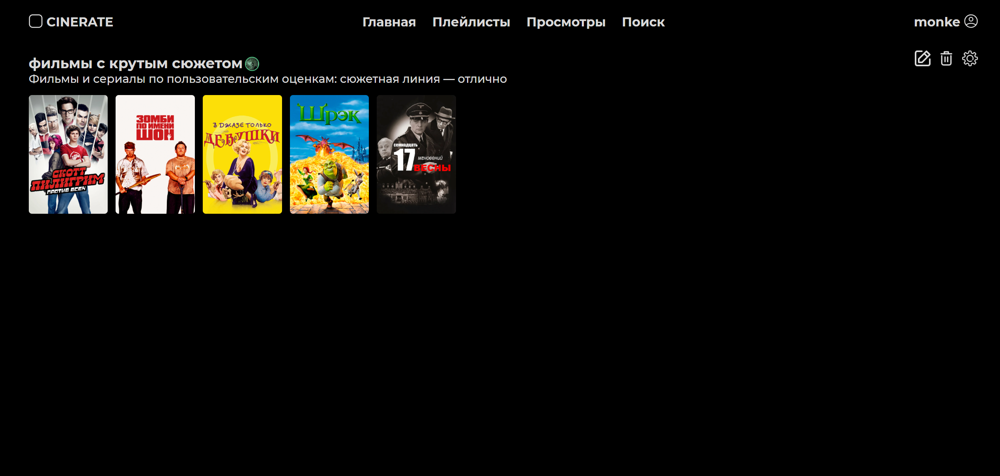

<div align="center">
  <h1>🎬 CineRate</h1>
  <p><strong>Ваш персональный кинопортал для учёта и организации просмотров</strong></p>

  <p>
    
    
    
    
  </p>

  <h3>
    <a href="#✨-ключевые-возможности">Возможности</a> •
    <a href="#🖼️-скриншоты">Скриншоты</a> •
    <a href="#🚀-быстрый-старт">Быстрый старт</a> •
    <a href="#📁-структура-проекта">Структура</a> •
    <a href="#📚-документация">Документация</a>
  </h3>
</div>

---

## ✨ Ключевые возможности

CineRate — это полноценное веб-приложение для киноманов. Оно позволяет не просто вести список просмотренного, но и гибко управлять своей коллекцией, а также делиться ей с друзьями.

*   **👤 Управление профилем:** Регистрация, настройка приватности и персонализация.
*   **🤝 Социальная сеть:** Подписки на других пользователей, коллаборативное редактирование плейлистов.
*   **🎥 Детальная работа с контентом:**
    *   Добавление фильмов и сериалов (с поддержкой сезонов как отдельных записей).
    *   Гибкие статусы: "Запланировано", "Просмотрено".
    *   Детальные оценки по различным критериям.
*   **🔍 Умный поиск:**
    *   Внешний поиск по базе Kinopoisk (или другому API) для быстрого добавления.
    *   Внутренний поиск и фильтрация по своей коллекции.
*   **📀 Гибкие плейлисты (подборки):**
    *   **Статические:** Ручное создание и добавление фильмов.
    *   **Динамические («умные»):** Автоматически наполняются на основе заданных фильтров (жанр, актер, год и т.д.).
*   **🔐 Настройка доступа:** Публичные и приватные плейлисты с возможностью выдавать права на редактирование.

---

## 🖼️ Скриншоты

### Регистрация и профиль пользователя
Пользователи могут регистрироваться, проходить аутентификацию и настраивать профиль с личными данными и параметрами приватности.


*Страница авторизации/аутентификации*   
---
### Социальные функции
Реализована возможность подписываться на других пользователей. Также предусмотрено совместное редактирование плейлистов за счёт добавления коллабораторов с правами на изменение.


*Страница профиля пользователя*   
---
### Работа с фильмами и сериалами
Пользователи могут добавлять фильмы и сериалы. Сериалы представлены отдельными сезонами, которые добавляются как отдельные фильмы. Для каждого элемента доступно добавление в запланированное, отметка просмотра и выставление оценки по разным критериям.


*Страница запланированное*   
---

*Страница просмотренное*   
---

*Меню оценки фильма при добавлении в просмотренное*   
---
### Поиск и фильтрация
Возможен поиск по различным параметрам, таким как название, актеры, жанры, дата выхода и другим характеристикам.


*Внешний поиск (во внешнем API)*   
---

*Внутренний поиск (среди своих фильмов)*   
---
### Плейлисты
Пользователи создают плейлисты вручную, а также могут создавать плейлисты с автоматическим наполнением на основе фильтров (например, по актерам, дате выхода, оценкам и т.п.). Такие списки автоматически дополняются при добавлении новых фильмов или сериалов, соответствующих заданным условиям.


*Страница плейлисты*   
---

*Меню создания плейлиста*   
---

*Меню генерации плейлиста*   
---

*Пример содержимого плейлиста*

### Настройки приватности
Плейлисты могут быть как публичными, так и приватными. Создатель задаёт доступ и права на совместное редактирование, добавляя участников.


*Меню настройки доступов*   

> *(Все скриншоты доступны в папке [`/docs`](/docs))*

---

## 🚀 Быстрый старт (Docker Compose)

Самый простой способ запустить проект целиком.

### Предварительные требования
*   Установленные [Docker](https://docs.docker.com/get-docker/) и [Docker Compose](https://docs.docker.com/compose/install/)
*   Утилита `yq` (для обработки YAML) - *см. Шаг 3*

### Инструкция по развертыванию на Ubuntu 22.04

1.  **Клонируйте репозиторий:**
    ```bash
    git clone https://github.com/Kirillex22/cinerate.git
    cd cinerate
    ```

2.  **Настройте конфигурацию бэкенда:**
    Перейдите в папку `backend` и создайте файл `config.yaml` на основе `example_config.yaml`.
    ```bash
    cd backend
    cp example_config.yaml config.yaml
    # Отредактируйте config.yaml, указав свои данные (JWT_SECRET, токен API и т.д.)
    nano config.yaml
    cd ..
    ```

3.  **Установите `yq` (если не установлен):**
    ```bash
    sudo wget https://github.com/mikefarah/yq/releases/latest/download/yq_linux_amd64 -O /usr/local/bin/yq
    sudo chmod +x /usr/local/bin/yq
    yq --version
    ```

4.  **Загрузите конфигурацию в переменные окружения:**
    ```bash
    source drop_config_to_env.sh
    ```

5.  **Запустите контейнеры:**
    Вернитесь в корень и выполните:
    ```bash
    docker-compose up -d
    ```

После успешного запуска:
*   **Фронтенд** будет доступен по адресу: `http://localhost`
*   **Бэкенд API:** `http://localhost/api`
*   **Документация API (Swagger):** `http://localhost/api/docs`

---

## 📁 Структура проекта

Проект разделен на два основных компонента:

```
cinerate/
├── backend/                 # FastAPI приложение (Python)
│   ├── api/                 # Точки входа (роуты)
│   ├── domain/              # Бизнес-логика, сущности
│   ├── infrastructure/      # Работа с БД, внешними API
│   ├── services/            # Сервисный слой (use cases)
│   ├── shared/              # Общие утилиты, исключения
│   └── web/                 # Модели запросов/ответов
│
├── frontend/                # Angular SPA приложение
│   ├── src/
│   │   ├── app/
│   │   │   ├── models/          # Интерфейсы данных
│   │   │   ├── services/        # Сервисы и HTTP-клиенты
│   │   │   ├── pages/           # Компоненты-страницы
│   │   │   ├── components/      # Переиспользуемые компоненты
│   │   │   ├── dialogs/         # Модальные окна
│   │   │   └── ...
│   │   ├── index.html
│   │   ├── main.ts
│   │   └── styles.css
│   └── ...
│
├── docs/                    # Изображения для документации
├── docker-compose.yml
├── drop_config_to_env.sh
└── README.md
```

---

## 📚 Документация

Для более детального знакомства с проектом перейдите к специализированным руководствам:

*   **[Документация бэкенда](backend/README.md)**: Архитектура, конфигурация, запуск в dev-режиме.
*   **[Документация фронтенда](frontend/README.md)**: Технологии, структура, запуск.
*   **[API Reference](http://localhost:8000/redoc)**: Интерактивная документация по API (ReDoc).

---

## 🤝 Как внести вклад

Мы приветствуем вклад в развитие проекта! Пожалуйста, ознакомьтесь с правилами внесения изменений (CONTRIBUTING.md) и создавайте issue или pull request.

---

## 📄 Лицензия

Проект распространяется под лицензией AGPL-3.0. Подробнее см. в файле `LICENSE`.
