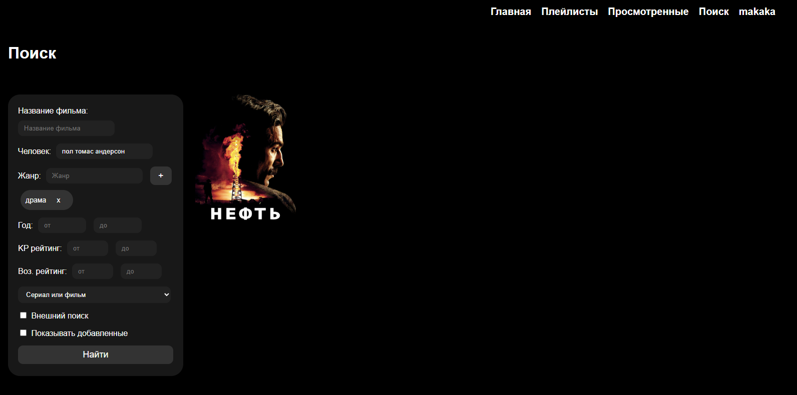
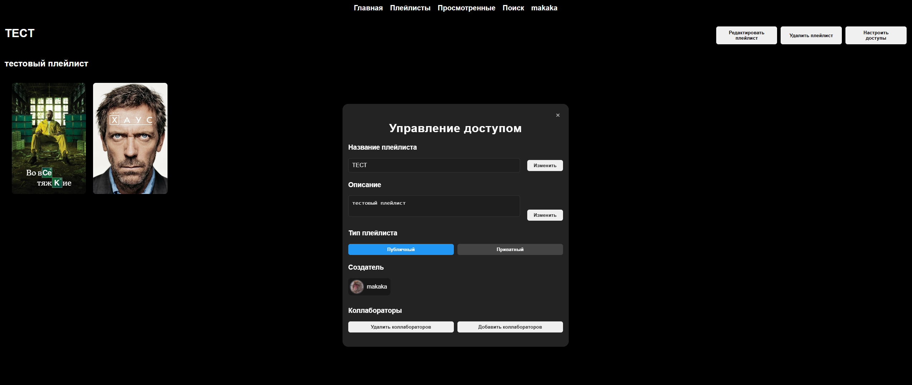

# Структура

## backend -> REST FastAPI сервиc, БД - PostrgeSQL 15
## frontend -> SPA Angular 

# Презентация

### Регистрация и профиль пользователя
Пользователи могут регистрироваться, проходить аутентификацию и настраивать профиль с личными данными и параметрами приватности.


*Страница авторизации/аутентификации*   
---
### Социальные функции
Реализована возможность подписываться на других пользователей. Также предусмотрено совместное редактирование плейлистов за счёт добавления коллабораторов с правами на изменение.


*Страница профиля пользователя*   
---
### Работа с фильмами и сериалами
Пользователи могут добавлять фильмы и сериалы. Сериалы представлены отдельными сезонами, которые добавляются как отдельные фильмы. Для каждого элемента доступно добавление в запланированное, отметка просмотра и выставление оценки по разным критериям.


*Страница запланированное*   
---

*Страница просмотренное*   
---

*Меню оценки фильма при добавлении в просмотренное*   
---
### Поиск и фильтрация
Возможен поиск по различным параметрам, таким как название, актеры, жанры, дата выхода и другим характеристикам.


*Внешний поиск (во внешнем API)*   
---

*Внутренний поиск (среди своих фильмов)*   
---
### Плейлисты
Пользователи создают плейлисты вручную, а также могут создавать плейлисты с автоматическим наполнением на основе фильтров (например, по актерам, дате выхода, оценкам и т.п.). Такие списки автоматически дополняются при добавлении новых фильмов или сериалов, соответствующих заданным условиям.


*Страница плейлисты*   
---

*Меню создания плейлиста*   
---

*Меню генерации плейлиста*   
---

### Настройки приватности
Плейлисты могут быть как публичными, так и приватными. Создатель задаёт доступ и права на совместное редактирование, добавляя участников.


*Меню настройки доступов*   
---

# Инструкция по развертыванию через `docker-compose` на Ubuntu 22.04 

### Шаг 1. Клонирование проекта
Склонируйте репозиторий проекта и перейдите в его папку:

```bash
    git clone https://github.com/Kirillex22/cinerate.git
    cd cinerate-api
```

### Шаг 2.
Зайдите в папку `/backend` и создайте файл `config.yaml`. В данный файл, по примеру из `example_config.yaml`, введите необходимые для работы приложения данные.

### Шаг 3.
Убедитесь, что на машине установлен `yq`
```bash
    # скачиваем последнюю версию
    wget https://github.com/mikefarah/yq/releases/latest/download/yq_linux_amd64 -O /usr/local/bin/yq
    # делаем исполняемым
    sudo chmod +x /usr/local/bin/yq
    # проверяем
    yq --version
```
### Шаг 4.
Убедитесь, что у вас установлен `Docker (compose)`
```bash
    sudo apt update
    sudo apt install -y docker.io
    sudo systemctl enable --now docker
    sudo usermod -aG docker $USER
```
### Шаг 5. 
Выполните
```bash
    source drop_config_to_env.sh
```
### Шаг 6.
Далее перейдите в корень проекта и выполните
```bash
    docker-compose up -d 
```

* В папке `jenkins` доступ готовый groovy-скрипт для развертывания
* Сервис будет доступен по протоколу `HTTP` на стандартном порту (80) (например `http://localhost`)
